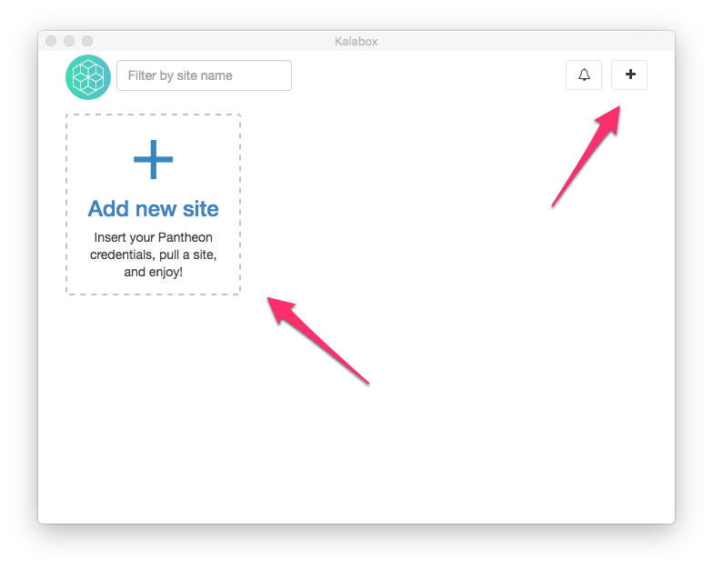
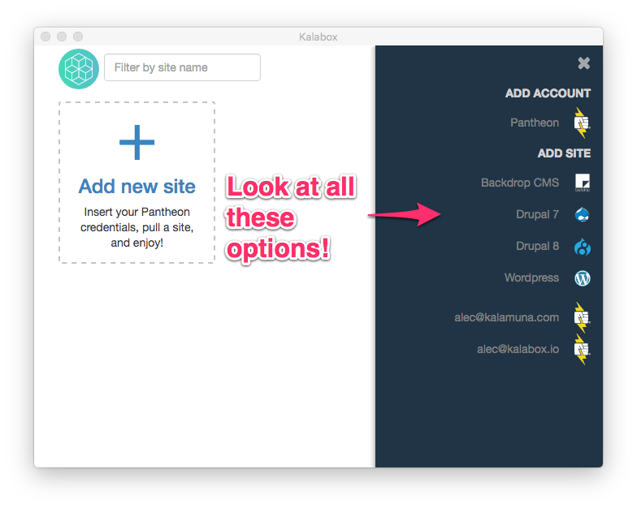
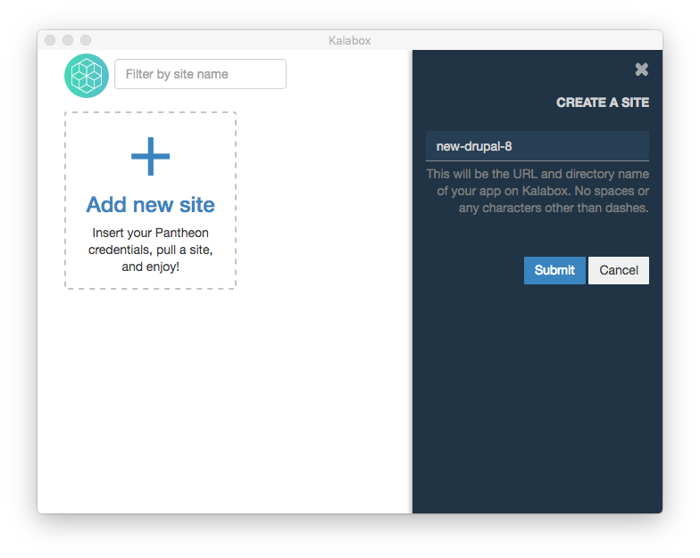
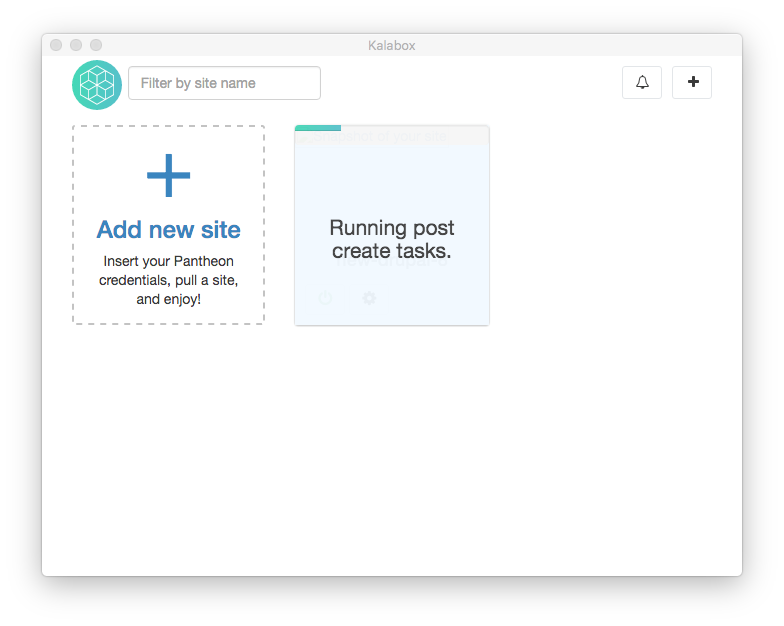
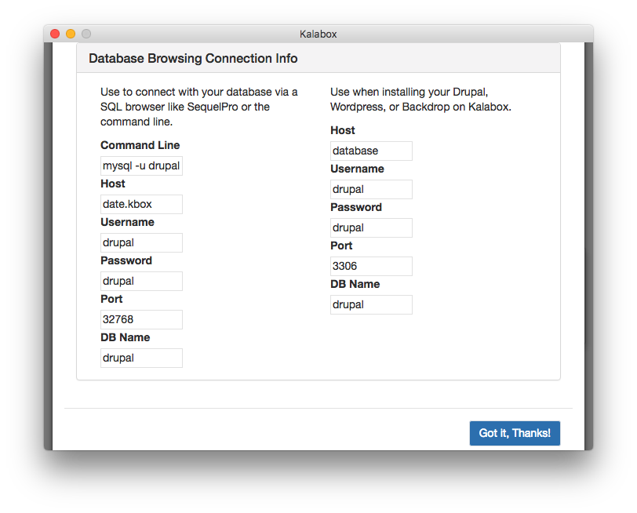

Kalabox GUI for PHP Apps
=====================

The Kalabox GUI allows you to create new Drupal, WordPress, and Backdrop sites that you can develop on your local computer, all with a few clicks of your mouse.

## Access the Sidebar

The sidebar is where you can create new sites. To access the sidebar, either click "Add New Site" or the "+" button in the upper right-hand corner.

## Create a New Site

Click on any of the available app options:

### Name and Pull the Site

A prompt should appear asking you to name your site:

The name that you provide for the site will become the site's Kalabox URL:
"[name-of-site].kbox". It must be alpha-numeric; the only allowed special
character is a dash.

!!! caution "Non-Latin Characters"
    Right now Kalabox does not support characters beyond the 26 common Latin ones. This would be a great pull request (hint hint)!

Hit "Submit" and you'll be off to the races!

!!! note "Why is My Site Taking So Long to Download?"
    When you first pull a site, creation will take longer. This is because Kalabox is downloading many extra assets (Docker images) needed to run your site on Kalabox.

Your app should show up on the dashboard immediately, although it will be greyed out and will only show status messages regarding the creation progress:

When it has finished downloading, the green power light should be on and a color screenshot should be present:

Click on the screenshot or site title to visit your site in the browser.

## Get Database Connection Info

If you click the "Actions" gear symbol on your new Pantheon app, you'll see a number of options. Select "Connection Info" to see the database credentials to connect to your apps database from a browser like [PHPMyAdmin](https://www.phpmyadmin.net) or [SQLPro](http://www.sequelpro.com/):

## Deploying Your Work

To deploy your work, you'll need to export your code, database, and files to your production server. We recommend pushing to a shared git repository to export your code, using the database connection info to transfer your database, and copying your files directory (located in the app root under /files), but there are many workflows.

!!! note "Working with Pantheon?"
    See our [Pantheon App docs](http://pantheon.kalabox.io) for a push-button workflow integrating with the Pantheon hosting service.
